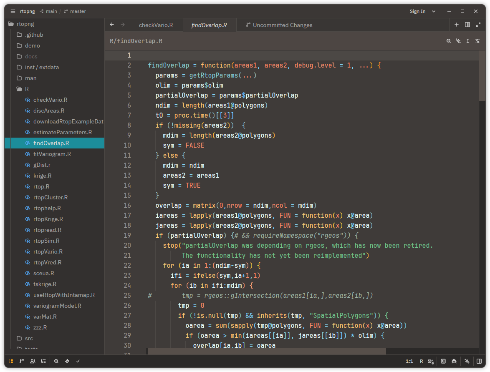

# Pop Theme for Zed

[](https://zed.dev/extensions/pop-theme)

A port of the Pop!_OS design language for the [Zed Editor](https://zed.dev).

## About

This theme brings the warm browns, electrifying teals, and scintillating tangerines of System76's Pop!_OS to Zed. It is based on the color scheme originally ported to VS Code by [ArtisanByteCrafter](https://github.com/ArtisanByteCrafter/VSCodePopTheme).

## Gallery
#### `01` Pop Dark

<p align="center">
    
</p>

#### `02` Pop Light

**TBA**

<!--<p align="center">
    
</p>-->

## Tips

Pop Theme works much better with Zed's built-in bracket colorisation (so-called "rainbow" brackets). Enable it globally in your `settings.json`:

```json
{
  "colorize_brackets": true
}
```

## Installation

### Zed Extensions:
1. Open Zed
2. Press `Cmd+Shift+P` (macOS) / `Ctrl+Shift+P` (Linux/Windows)
3. Type "extensions" and select **Extensions: Install Extensions**
4. Search for "Pop Theme"
5. Click **Install**

### Manual installation
1. Copy `pop-theme.json` to `~/.config/zed/themes/`.
2. In Zed navigate to `Settings :: Theme :: Pop Dark/Light`.

## See also

* [**VS Code Pop Theme**](https://github.com/ArtisanByteCrafter/VSCodePopTheme) — The original VS Code port by [@ArtisanByteCrafter](https://github.com/ArtisanByteCrafter)
* [**Pi Pop Theme**](https://github.com/atsyplenkov/pi-pop-theme) — The Pi Coding Agent theme

## Acknowledgements

- [**@ArtisanByteCrafter**](https://github.com/ArtisanByteCrafter/VSCodePopTheme) — The original VS Code port of the Pop!_OS theme
- [System76](https://system76.com/) — Creators of Pop!_OS and the original design language
- This project has made use of AI-assisted pair programming using `Kimi-K2.5` and `Pi`

## License

MIT License. See [LICENSE](./LICENSE).
